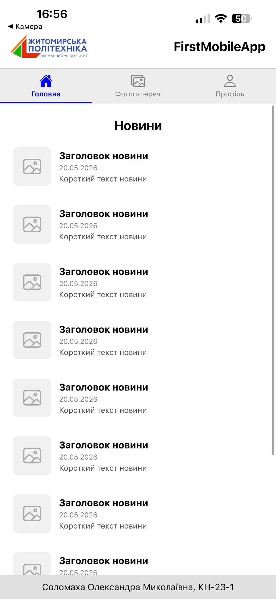
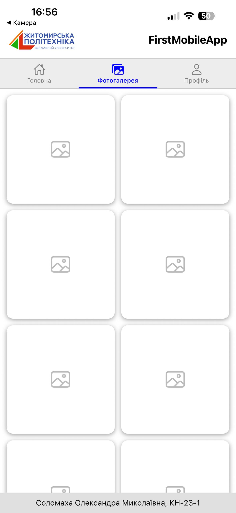
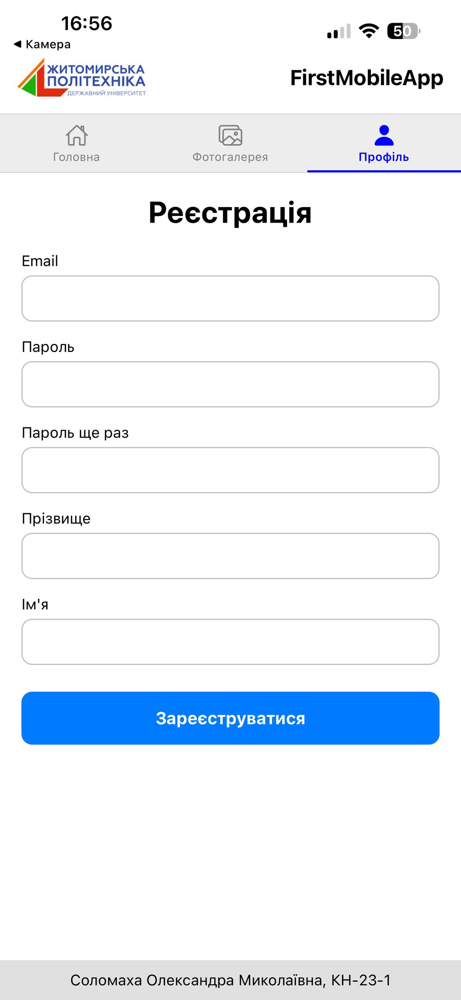

# Лабораторна робота №1- Перший мобільний додаток

Мобільний додаток створений за допомогою React Native та Expo в рамках лабораторної роботи.

## Опис

Додаток містить три екрани:

- **Головна** — стрічка новин
- **Фотогалерея** — сітка зображень у два стовпці
- **Профіль** — форма реєстрації

## Інструкція по запуску

### 1. Встановити залежності
npm install

### 2. Запустити проєкт

npx expo start

### 3. Відкрити на телефоні

- Встановити додаток Expo Go
- Відсканувати QR-код, який з’явиться в терміналі

##  Скріншоти

## Головна

## Фотогалерея

## Профіль

## Використані технології

- React Native
- Expo SDK 54
- React Navigation
- Expo Vector Icons

## Студент 

Соломаха Олександра Миколаївна  
Група: КН-23-1