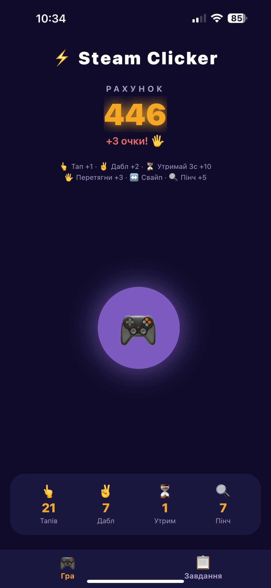
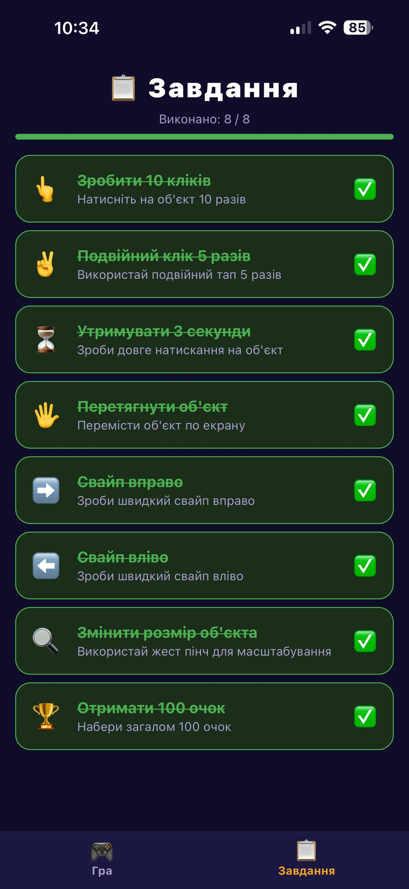

# Лабораторна робота №3 Steam Clicker

Мобільний додаток-гра клікер, розроблений у рамках лабораторної роботи №3.  
Тема: **Використання жестів у React Native за допомогою react-native-gesture-handler**

## ункціонал

-  **Тап** — +1 очко
-  **Подвійний тап** — +2 очки
-  **Довге натискання** — +10 очок
-  **Перетягування (Pan)** — +3 очки
-  **Свайп вправо/вліво (Fling)** — випадкова кількість очок
-  **Пінч (Pinch)** — +5 очок, масштабування об'єкта
-  **Сторінка завдань** — список із прогрес-баром виконання

## Інструкція по запуску

### 1. Встановлення залежностей

npm install --legacy-peer-deps

npx expo install react-native-gesture-handler react-native-screens react-native-safe-area-context

npm install @react-navigation/native @react-navigation/bottom-tabs --legacy-peer-deps

npx expo install babel-preset-expo --check

### 2. Запуск проєкту

npx expo start --clear

### 4. Відкриття на пристрої

- Встановіть **Expo Go** на свій смартфон (App Store або Google Play)
- Відскануйте QR-код з терміналу камерою (iOS) або через Expo Go (Android)

---

## Технології

| Технологія | Версія |
|---|---|
| Expo SDK 
| React Native 
| react-native-gesture-handler 
| @react-navigation/native 
| @react-navigation/bottom-tabs 

## Скріншоти

### Головний екран

### Екран завдань

---

## Студент 

Соломаха Олександра Миколаївна  
Група: КН-23-1