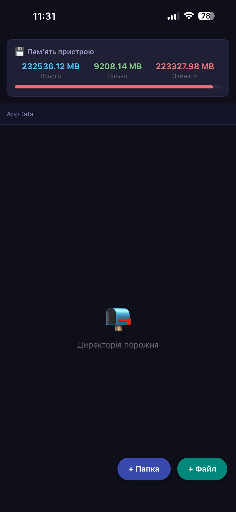
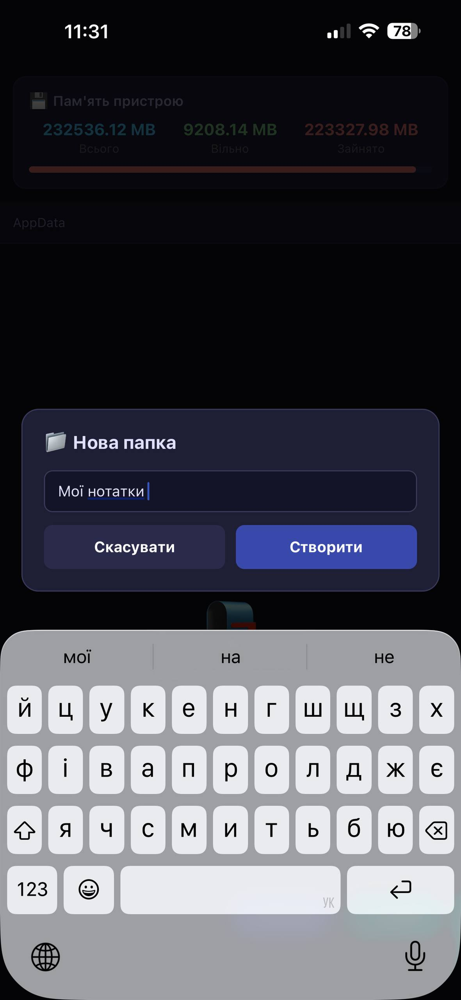
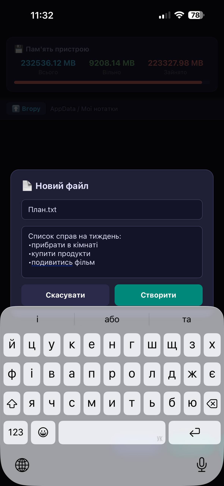
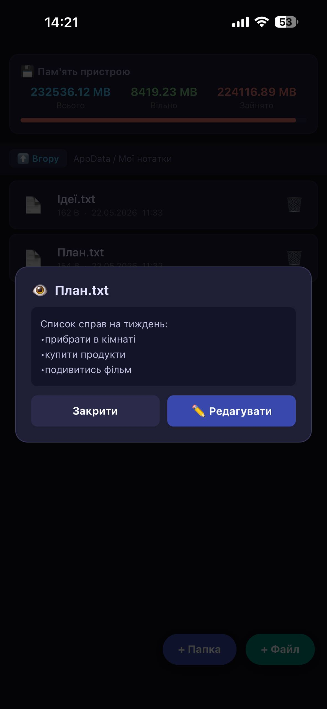
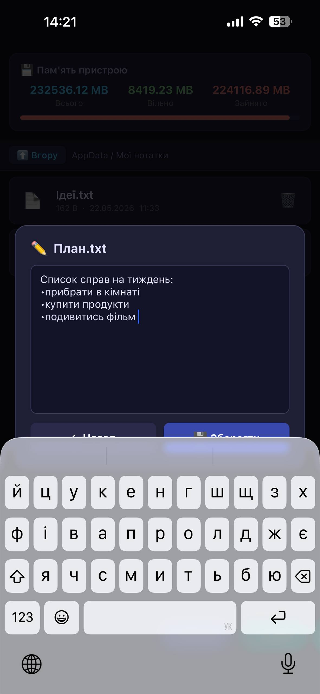
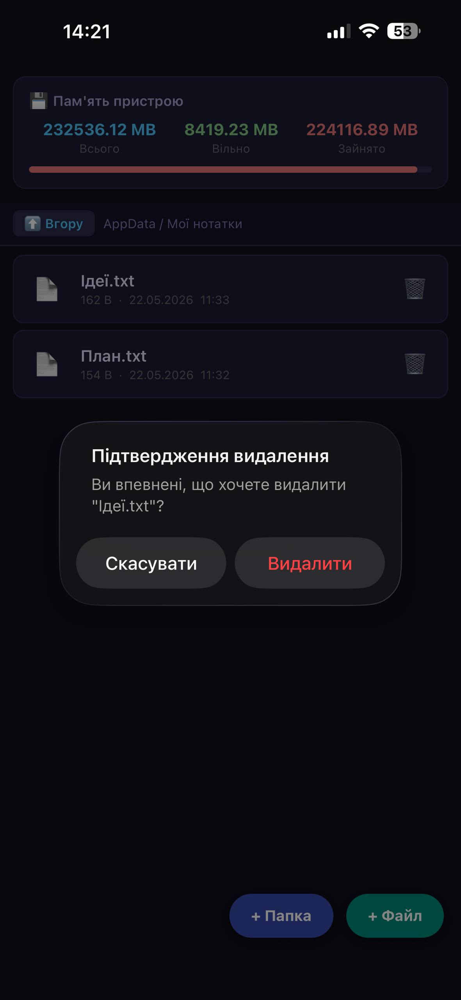

# Файловий менеджер — Лабораторна робота №5

Мобільний застосунок для роботи з локальною файловою системою на базі **React Native** та **Expo**, з використанням бібліотеки `expo-file-system`.

## Функціональні можливості

| Функція | Опис |
|---|---|
| Навігація | Перехід у вкладені папки та назад |
| Статистика пам'яті | Відображення загального, вільного та зайнятого простору |
| Створення папки | Створення нової директорії з введеною назвою |
| Створення файлу | Створення `.txt` файлу з початковим вмістом |
| Перегляд файлу | Відкриття та читання текстових файлів |
| Редагування файлу | Зміна вмісту файлу та збереження |
| Видалення | Видалення файлу або папки з підтвердженням |
| Деталі файлу | Назва, тип, розмір, дата зміни (довге натискання) |

---

## Скріншоти

### Головний екран зі статистикою пам'яті

### Створення папки

### Створення файлу

### Перегляд файлу

### Редагування файлу

### Видалення з підтвердженням

### Детальна інформація про файл

