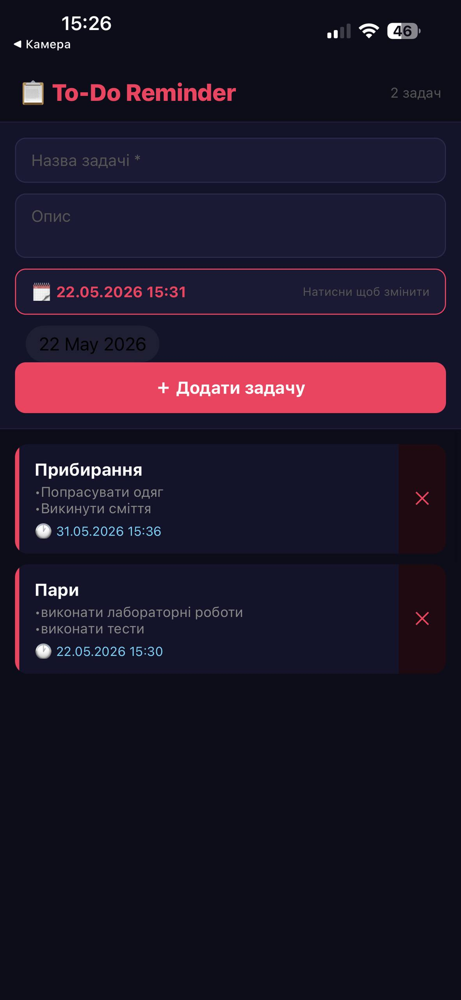

# Лабораторна робота №4 To-Do Reminder App

Мобільний застосунок для створення задач із нагадуваннями.
Розроблений на React Native за допомогою Expo.

---

# Можливості

- Додавання задач
- Додавання опису задачі
- Вибір дати та часу нагадування
- Push-сповіщення
- Видалення задач
- Сучасний UI у темній темі


# Технології

- React Native
- Expo
- expo-notifications
- DateTimePicker


## Перейти у папку проєкту

```bash
cd project-name
```

## Встановити залежності

```bash
npm install
```

---

## Запустити Expo

```bash
npx expo start
```


## 5. Відкрити застосунок

- Встановити Expo Go на телефон
- Відсканувати QR-код

---

# Скріншоти

## Додавання задачі


---

## Список задач




## Список задач


## Студент 

Соломаха Олександра Миколаївна  
Група: КН-23-1